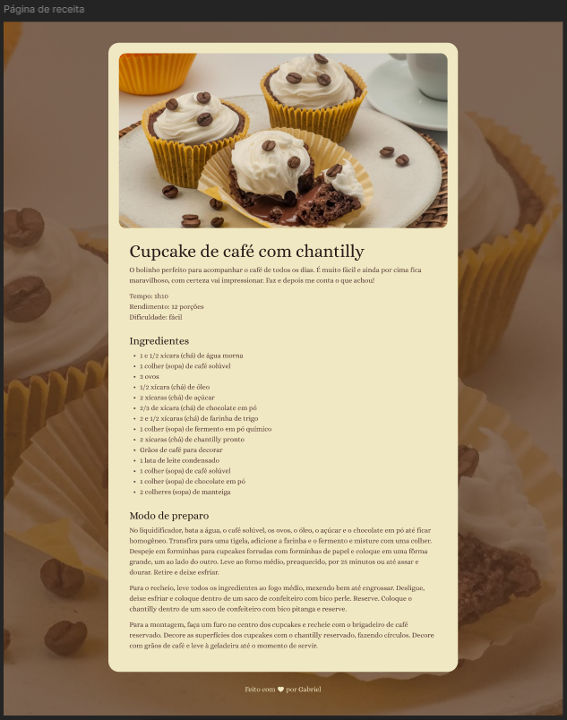

# Página de Receitas

📜 Web-design responsivo de um protótipo de uma página de receitas temática.

💡 Projeto desenvolvido com foco na responsividade e tematização de um design atrativo para criação de uma página de receitas.

   💻 Tecnologias utilizadas:
    <ul>
       <li>HTML5</li>
       <li>CSS3</li>
       <li>VCS GIT</li>
       <li>GITHUB</li>
       <li>User Interface (UI)</li>
    </ul> 

## 📋 Meta

Gabriel C. Martins – gacmartins@gmail.com

[Meu Perfil no GITHUB.](https://github.com/Gabriel-Dev-C/)

## 🚀 Contribuição

1. Faça o _fork_ do projeto (<https://github.com/Gabriel-Dev-C/Pagina-Receita/fork>)
2. Crie uma _branch_ para sua modificação (`git checkout -b meu-novo-recurso`)
3. Faça o _commit_ (`git commit -am 'Adicionando um novo recurso...'`)
4. _Push_ (`git push origin meu-novo-recurso`)
5. Crie um novo _Pull Request_
